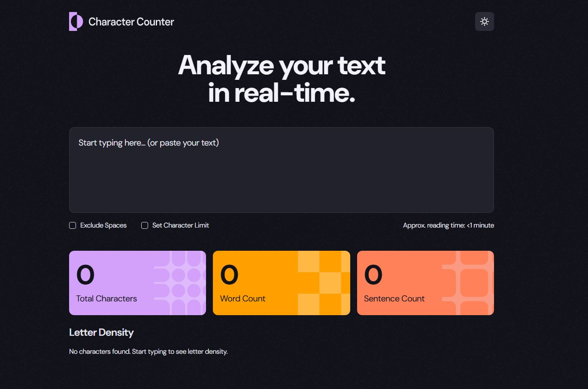

# Frontend Mentor - Character counter solution

This is a solution to the [Character counter challenge on Frontend Mentor](https://www.frontendmentor.io/challenges/character-counter-znSgeWs_i6). Frontend Mentor challenges help you improve your coding skills by building realistic projects.

## Table of contents

- [Overview](#overview)
  - [The challenge](#the-challenge)
  - [Screenshot](#screenshot)
  - [Links](#links)
- [My process](#my-process)
  - [Built with](#built-with)
  - [What I learned](#what-i-learned)
  - [Continued development](#continued-development)
- [Author](#author)

## Overview

### The challenge

The challenge is to build out this character counter and get it looking as close to the design as possible.

Users should be able to:

- Analyze the character, word, and sentence counts for their text
- Exclude/Include spaces in their character count
- Set a character limit
- Receive a warning message if their text exceeds their character limit
- See the approximate reading time of their text
- Analyze the letter density of their text
- Select their color theme
- View the optimal layout for the interface depending on their device's screen size
- See hover and focus states for all interactive elements on the page

### Screenshot



### Links

- Solution URL: [Github Repo](https://github.com/jmmarketing/character-count-tool)
- Live Site URL: [Character Count](https://jmmarketing.github.io/character-count-tool/)

## My process

### Built with

- Semantic HTML5
- CSS | SCSS
- MVC Design Pattern
- Flex
- Vanilla JS
- Figma Mockup
- [Parcel](https://parceljs.org/) - Bundler
- [GH-Pages](https://www.npmjs.com/package/gh-pages) - Deployment for GH Pages

### What I learned

In the model.js one of the function roles was to calculate the density of letters used in the input box. While getting the values associated with the density was not too challenging, I did not factor in sorting them. Originally based on what I had, the letter was the property and the metrics were an object in themselves. So I had to handle the sorting in the view, which led to this quick, concise snippet.

```js
const sortedLetters = Object.keys(obj)
  .map((letter) => ({ letter, ...obj[letter] }))
  .sort((a, b) => b.count - a.count);
```

It is not complex, but just very clean. I like that.

### Continued development

Use this section to outline areas that you want to continue focusing on in future projects. These could be concepts you're still not completely comfortable with or techniques you found useful that you want to refine and perfect.

**Note: Delete this note and the content within this section and replace with your own plans for continued development.**

## Author

- Website - [Add your name here](https://www.your-site.com)
- Frontend Mentor - [@yourusername](https://www.frontendmentor.io/profile/yourusername)
- Twitter - [@yourusername](https://www.twitter.com/yourusername)

**Note: Delete this note and add/remove/edit lines above based on what links you'd like to share.**
